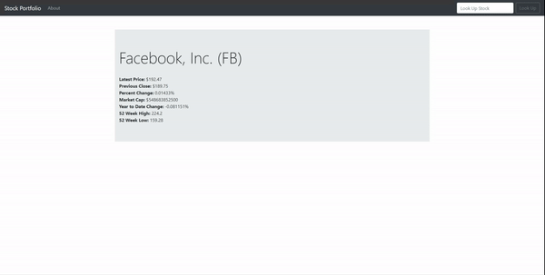

# nodejsstockmarketapp
Passing API data from Backend to the Front End using Handle Bars and Node.JS

sample logic

//set up Express JS
const express = require('express');
const app = express();
const exphbs  = require('express-handlebars');
const path =  require('path');
const request = require('request');
const bodyParser = require('body-parser');
const PORT = process.env.PORT || 5000;

//use body parser middleware
app.use(bodyParser.urlencoded({extended: false}));

// API key/API Token: pk_e86914e5202e4b1a901d7d87e4f19360 
//Create call_api function
function call_api(finishedAPI, ticker, response) {
    request('https://cloud.iexapis.com/stable/stock/'+ ticker +'/quote?token=pk_e86914e5202e4b1a901d7d87e4f19360',
     {json:true}, (err, res, body) => {
        if (err) return console.log(err);
        if (res.statusCode === 200){
            finishedAPI(body); 
        } else {
            response.render('error', {
                error_msg: body
            })
        }
    });
};

//set static folder
// app.use(express.static(path.join(__dirname, 'public')));

app.listen(PORT, () => console.log('Server Listening on port ' + PORT));

//Set Handlebars Middleware
app.engine('handlebars', exphbs());
app.set('view engine', 'handlebars');

//Handlebars test 
const otherstuff = "hello there, this is the other stuff...";

//Set Handlebars app GET routes
app.get('/', function (req, res) {
    call_api(function(doneAPI) {
        res.render('home', {
            stock: doneAPI
        });
    }, "fb", res);
});

//Set Handlebars app POST routes
// call_api(function, req.body.stock_ticker);
app.post('/', function (req, res) {
    call_api(function(doneAPI) {
        res.render('home', {
            stock: doneAPI,
        });
    }, req.body.stock_ticker, res);
});

//create about page route
app.get('/about', function (req, res) {
    res.render('about');
});

